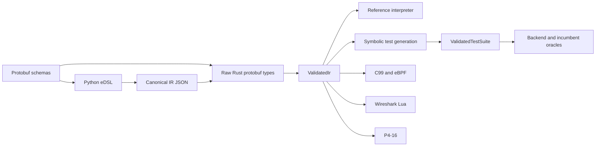

# Architecture and invariants

This note is the short map for maintainers. Historical decisions and detailed
designs remain under `docs/designs/` and `docs/superpowers/`; this document
describes the invariants the current code enforces.

## Data flow

The schemas are the wire contract. The Python package is the authoring surface,
not the validation authority: it provides fast diagnostics and emits protobuf
JSON. The Rust CLI parses, validates, and canonicalizes that JSON. Every
interpreter, generator, visualizer, and symbolic entry point accepts
`ValidatedIr`, so code past that boundary may rely on the complete semantic
invariants in `rust/pakeles/src/ir/validate.rs`.

Raw protobuf types remain public for serialization and tooling, but decoding
alone never establishes validity. Construct `ValidatedIr` with its checked
constructor, or load files through `ir::load`. The same rule applies to test
vectors through `ValidatedTestSuite`.

## Bounded work

Bounded parsing is a semantic property and a resource-safety property.
`max_depth` limits parser execution. Separate configurable limit types protect
the tooling itself:

- `ValidationLimits` caps graph and expression structure before downstream
  algorithms see it.
- `SymexLimits` caps path enumeration and solver checks; cyclic-state test
  coverage has an additional deliberate unroll bound.
- `PcapLimits` and `TestSuiteLimits` cap item counts, individual packet sizes,
  and aggregate retained bytes.
- `ProcessLimits` bounds child duration and retained stdout/stderr while still
  draining pipes. On Unix, timeout termination targets the entire child process
  group and always reaps the direct child.

Defaults are policy, not wire semantics. Callers with a legitimate larger
workload may choose explicit limits; removing the boundary is not the extension
mechanism. Set them an order of magnitude above the largest legitimate
workload in the repository — a ceiling the gallery can reach by growing
stops a build long before it stops an attack — and give the ones a real
parser can approach a CLI override (`testgen --max-paths`).

Generated files are written through sibling temporary files and atomically
renamed only after a successful flush. Multi-file backends should finish all
generation before publishing any member when partial sets would be misleading.

## Artifact confidence layers

Different artifacts answer different questions:

| Layer | What it establishes |
| --- | --- |
| Canonical committed IR | Python authorship and Rust semantics agree on one stable serialization |
| Generated-artifact equality | Checked-in C, eBPF, Lua, P4, docs, and graphs match the current generators |
| Symbolic conformance | Every enumerated parse path has a witness and agrees with the reference interpreter |
| Real backend execution | Compiled C/eBPF/P4 and tshark behavior agree on the vectors |
| Versioned incumbent goldens | A gallery projection agrees with the named external implementation at the pinned version |

Do not collapse these layers. In particular, regenerating committed backend
output immediately before its equality assertion would turn the assertion into
a comparison of fresh output with itself. `scripts/test.sh` regenerates only
the ignored vector suites for this reason.

## Dependency direction

- `rust/pakeles` is the publishable library and CLI. It must remain independent
  of the gallery and vendors generated protobuf code so consumers need neither
  the repository layout nor `protoc`.
- `rust/pakeles-testkit` owns reusable backend conformance harnesses and is not
  published.
- `rust/pakeles-dev` owns repository regeneration and gallery-wide maintenance
  tests; core library code must not depend on it.
- Each industry benchmark is its own workspace crate and owns its projection,
  oracle, provenance, and committed golden.
- `third_party/` is the only location for vendored external source. Keep its
  license and provenance notes with the code.

The default `cli` and `symex` features are conveniences, not assumptions for
library consumers. `scripts/check-features.sh` protects the library-only,
CLI-only, symbolic-only, and complete shapes.
