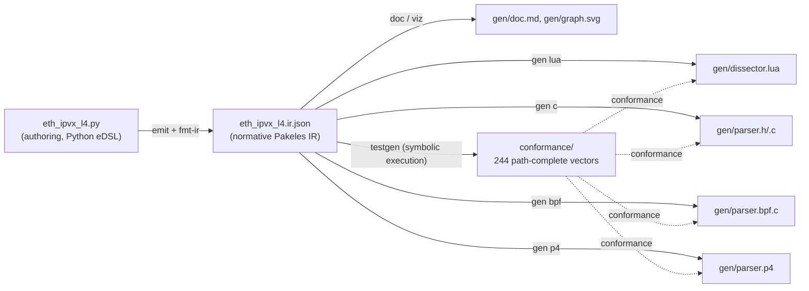
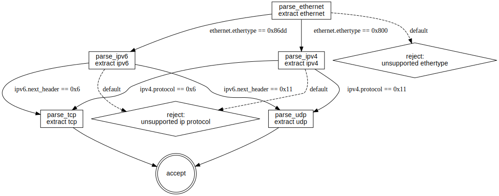

# Example: `eth_ipvx_l4`

**Start here.** This is Pakeles's hello-world: Ethernet → {IPv4 | IPv6} →
{TCP | UDP}. It *branches* — EtherType demuxes to IPv4 or IPv6, and each
IP header demuxes to a shared TCP or UDP successor (a join in the parse
DAG) — so it shows the thing the IR exists to express: **a parser is a
state machine that chooses its next state from what it just read**, not
just a struct laid over bytes.

One description in, every artifact out — and all of them provably agree.
This directory is organized by role: the **input**, the **contract**,
and everything **derived** from it.



Every file is committed **and equality-guarded**: if anything here
drifts from what the toolchain generates, CI fails. Regenerate with
`./dev.sh cargo run --bin gen_examples`.

## The input

| File | What it is | Verified by |
|---|---|---|
| [`eth_ipvx_l4.py`](eth_ipvx_l4.py) | The description, authored in the Python eDSL (mirrored from [`py/`](../../py)) | proto-equal to `eth_ipvx_l4.ir.json`, which the independent Rust builder ([`src/examples.rs`](../../src/examples.rs)) also produces |

## The contract

| File | What it is | Verified by |
|---|---|---|
| [`eth_ipvx_l4.ir.json`](eth_ipvx_l4.ir.json) | The normative Pakeles IR (protojson) — the only artifact other tools consume | schema validation + reference interpretation; differentially tested against `tshark` on real captures |

## Derived: implementations that provably agree

| File | What it is | Verified by |
|---|---|---|
| [`gen/dissector.lua`](gen/dissector.lua) | Working Wireshark dissector (Lua 5.2) | field comparisons inside real `tshark`, zero mismatches |
| [`gen/parser.h`](gen/parser.h) / [`gen/parser.c`](gen/parser.c) | Portable C99 parser (zero-copy, bit-granular) | field-for-field on **all 244 vectors**; compiles `-Wall -Wextra -Werror` clean |
| [`gen/parser.bpf.c`](gen/parser.bpf.c) | Self-contained eBPF variant (verifier-shaped core) | verdict-level on all 244 vectors under the rbpf VM |
| [`gen/parser.p4`](gen/parser.p4) | P4-16 program (v1model) | verdict-level on all 42 byte-aligned vectors under BMv2 `simple_switch`; `p4test` + `p4c-bm2-ss` warning-free |

## Derived: presentation

| File | What it is | Verified by |
|---|---|---|
| [`gen/doc.md`](gen/doc.md) | Field tables + parse graph documentation | equality guard |
| [`gen/graph.dot`](gen/graph.dot) / [`gen/graph.svg`](gen/graph.svg) | The parse graph | equality guard |

## The conformance suite that binds them

| File | What it is | Verified by |
|---|---|---|
| [`conformance/vectors.json`](conformance/vectors.json) | Path-complete suite: 244 solver-derived vectors (24 accept / 18 reject / 202 truncation — every parse path across both IP versions and both transports gets a witness packet) | replayed by the reference interpreter in CI; cross-validated by path ids |
| [`conformance/vectors.pcap`](conformance/vectors.pcap) | The 42 byte-aligned vectors as a capture file | same vectors, wire form |

## A note on IPv6 addresses

IPv6's 128-bit `src`/`dst` exceed the fixed-width field ceiling (≤ 64
bits), so they are modelled as opaque 16-byte runs — rendered as hex,
and (unlike the IPv4 addresses) not diffed against `tshark`, whose
values the u64 oracle can't represent. Their conformance rests on the
interpreter and the C/eBPF/P4 backends, which all agree by construction.

## Try it

Any machine with Wireshark ≥ 4.x — no build required:

```sh
tshark -X lua_script:gen/dissector.lua -r conformance/vectors.pcap -V
```

The dissector registers as a postdissector, so its tree appears
alongside Wireshark's built-in dissection — side-by-side comparison for
free.


